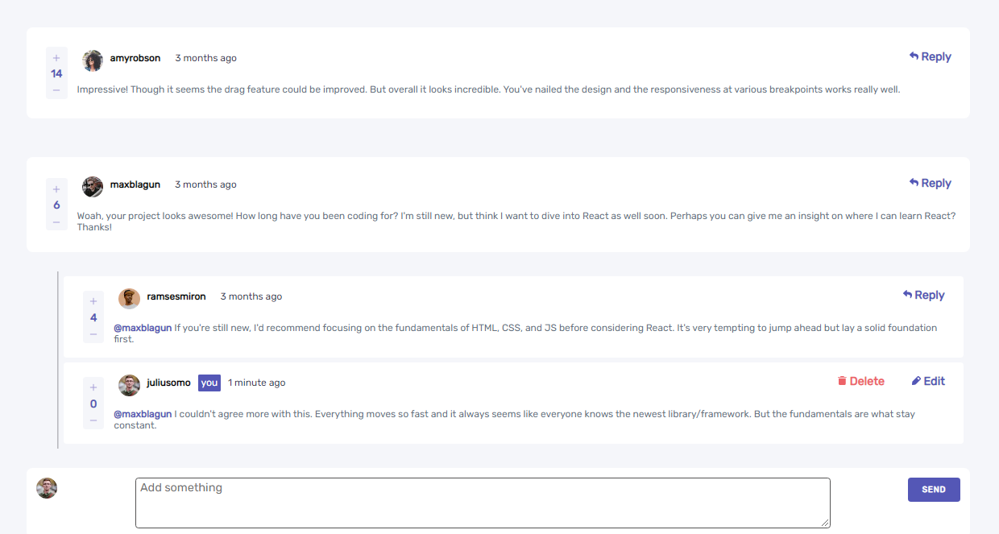

# Frontend Mentor - Interactive comments section solution

This is a solution to the [Interactive comments section challenge on Frontend Mentor](https://www.frontendmentor.io/challenges/interactive-comments-section-iG1RugEG9). Frontend Mentor challenges help you improve your coding skills by building realistic projects. 

## Table of contents

- [Overview](#overview)
  - [The challenge](#the-challenge)
  - [Screenshot](#screenshot)
  - [Links](#links)
- [My process](#my-process)
  - [Built with](#built-with)
  - [What I learned](#what-i-learned)
  - [Continued development](#continued-development)
  - [Useful resources](#useful-resources)
- [Author](#author)
- [Acknowledgments](#acknowledgments)

## Overview

### The challenge

Users should be able to:

- View the optimal layout for the app depending on their device's screen size
- See hover states for all interactive elements on the page
- Create, Read, Update, and Delete comments and replies
- Upvote and downvote comments
- **Bonus**: If you're building a purely front-end project, use `localStorage` to save the current state in the browser that persists when the browser is refreshed.
- **Bonus**: Instead of using the `createdAt` strings from the `data.json` file, try using timestamps and dynamically track the time since the comment or reply was posted.

### Screenshot



### Links

- Live Site URL: [Site](https://comment-f-end.vercel.app/)

## My process

### Built with

- Semantic HTML5 markup
- CSS custom properties
- Flexbox
- React.js
- Next.js
- Node.js
- Express.js
- Mobile-first workflow
- [React](https://reactjs.org/) - JS library
- [Next.js](https://nextjs.org/) - React framework


### What I learned

In the process of building this project React Hooks was used in a Next.js Framework. Node and Express was used in the bakend.
The project was build with two different secion, one for the mobile screen view and the other for large screen view.
getServerSideProps is a Next.js function that fetch data from a server and pass the returned value as props to our component before the component gets rendered on the browser.


```html
       <div> <CommentList creator={currentUser} />
       </div>
```
```css
@media (min-width: 750px) {
    .smallContent {
        display: none;
    }
    .response {
        display: none;
    }
}
@media (max-width: 748px) {
    .bigContent {
        display: none;
    }
    .Bigresponse {
        display: none;
    }
}
```
```js
export async function getServerSideProps() {
  const creator = await fetch(process.env.BACKEND_URL,{ method: "GET" });
  const create = await creator.json()
  const resultCreator = create.response
  
  return {
    props: {
      currentUser: resultCreator
    },
  };
}
```

### Continued development

Next.js has alot to offer as a framework, there are much to learn when using this framework. One of the main advantage of using it is that it can be built using React hooks, and that helps alot for anyone that is larning React.
I didn't fully utilized Next.js server side functions, hopefully with more practice and projects, i will fully understand the framework.

### Useful resources

- [React](https://reactjs.org/) - JS library
- [Next.js](https://nextjs.org/) - React framework

- [React Time Ago](https://www.npmjs.com/package/react-time-ago) - This helped me for with the timastamp. I really liked the format and will use it going forward.


## Author

- Frontend Mentor - [@Geraldoeze](https://www.frontendmentor.io/profile/Geraldoeze)


